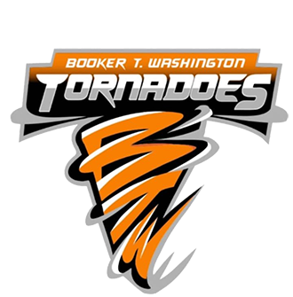

# 🧠 Athletes Chatboy

**Athletes Chatboy** is a Streamlit-based web app designed to help athletic staff manage student-athlete data with ease — including record entry, chatbot support, and document automation.



---

## 🎯 Features

- 📝 Enter and save student-athlete information (name, ID, grade, insurance, physical status)
- 🤖 Built-in AI chatbot powered by OpenAI (optional)
- 📁 Save athlete data to Excel or future database
- 🎨 Custom interface with Booker T. Washington branding and orange theme
- 🔒 Local data handling (secure and private unless connected to cloud storage)

---

## 🛠️ Technologies Used

- Python
- Streamlit
- Pandas
- OpenAI API (for chatbot)
- Excel file handling (`pandas.read_excel` / `to_excel`)

---

## 🚀 How to Run It Locally

1. Clone the repo:

```bash
git clone https://github.com/bassette143/athletes-chatboy.git
cd athletes-chatboy
